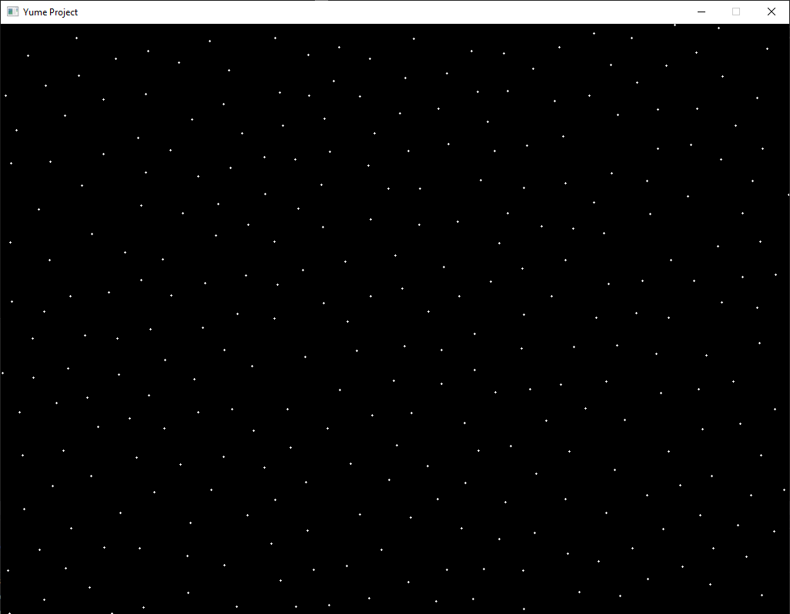

# Voronoi

I'm starting to create multiple little projects to try out my lib and figure out how to do things.  
The idea is to use it to see what's impractical to use and improve it.  
  
The idea on this one is generating a set of points using blue noise, then applying Delaunay Triangulation on it and creating a Voronoi Diagram.

## First step : blue noise

That one is done :  
  

  
Now to do the next step...  
